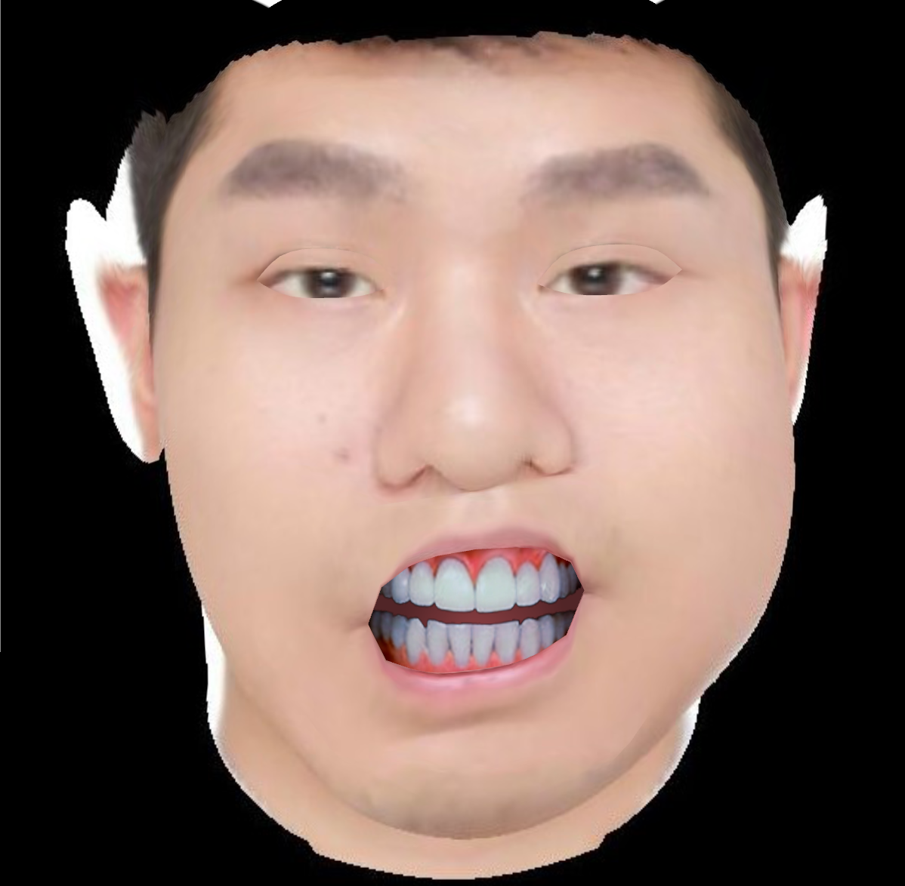

# 2D face Animation Generating
## 1. Using CrazyTalk to make 2D face talk according to audio
### a. Download and install CrazyTalk v7.2

### b. Import a 2D face image and adjust the key points on the face

### c. Import a audio or use its own audio to make 2D face talking by one button

## 2. Using Salsa lipSync v2.x toolkit in Unity3D
### a. Buy the toolkit and download it from Unity3D official website
### b. Generate some pictures with mouth opening or other parts of face changing based on original 2D face photos

### c. Set the options of Salsa lipsync v2.x in Unity3D
### d. Import an audio to make 2D face talk according to the volunm of audio
